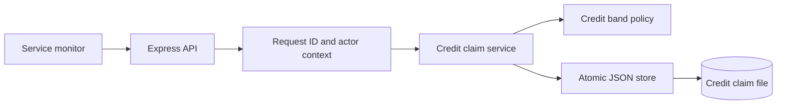
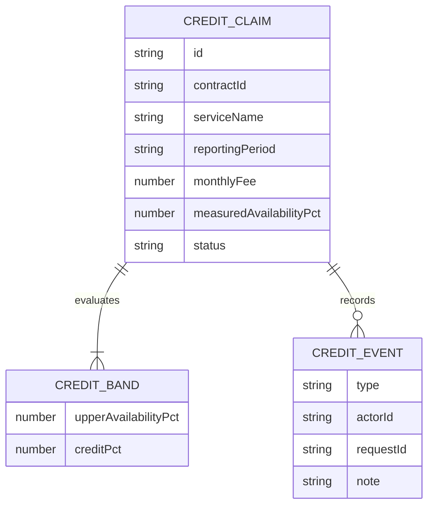
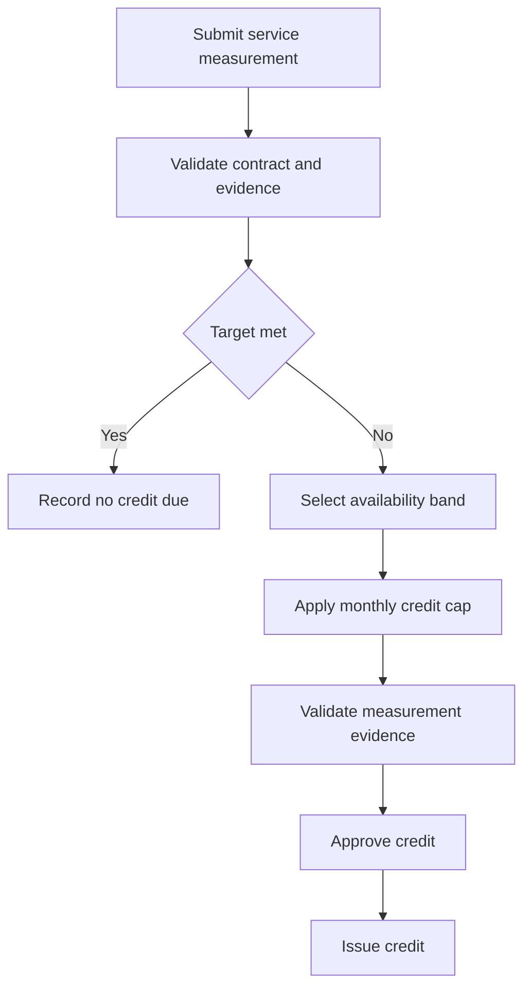
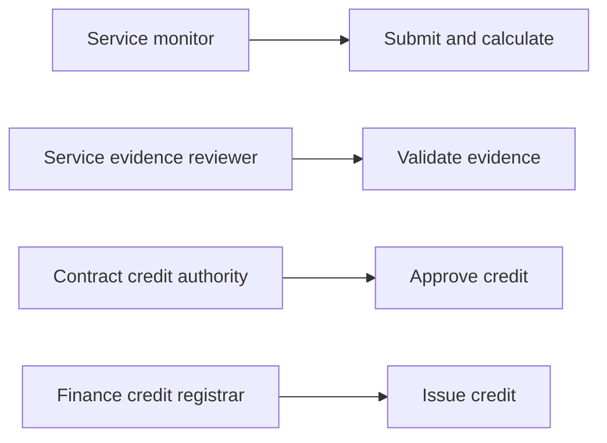
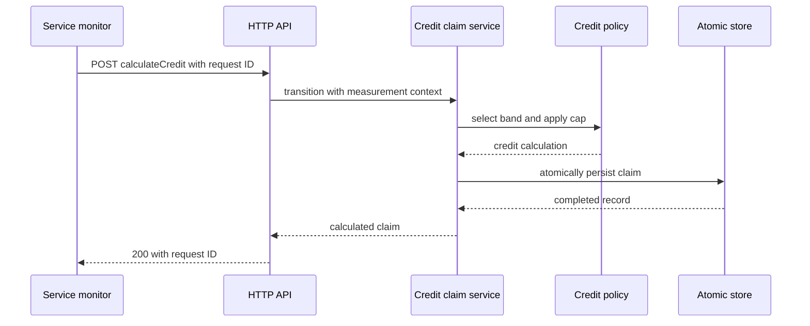

# Contract Service-Level Credit Calculation Engine

## The Problem

Service-level commitments are often monitored in one system, contract terms are held in another, and commercial credit calculations are performed manually after an outage. That separation creates inconsistent application of availability bands, credit caps, and evidence requirements. Finance teams can receive a credit request without a reproducible calculation or clear proof that measurement review and contractual approval occurred in the proper order.

## The Solution

This engine converts a service availability observation and contractual credit schedule into a durable credit claim. It selects the applicable availability upper-bound band, calculates the unbounded credit, applies the contractual monthly cap, and retains both amounts so an operator can see the direct effect of the cap. A service that meets the target is explicitly marked as no credit due.

The workflow separates monitoring, evidence validation, credit authority, and financial issuance. Each mutation uses a unique request identifier, records an audit event, and writes the complete data set through a temporary file and atomic rename. This provides a controlled record from evidence observation through final credit issuance.

## Live Demo and Tech Stack

The engine supports local and approved LAN operation. After startup, `http://127.0.0.1:65073/health` returns the health response. The source repository is [contract-service-level-credit-calculation-engine](https://github.com/kholipha-ahmmad-al-amin/contract-service-level-credit-calculation-engine).

| Layer | Implementation |
| --- | --- |
| Runtime | Node.js 22 with ECMAScript modules |
| HTTP service | Express 5 |
| Policy | Availability upper-bound bands with monthly credit cap |
| Governance | Monitoring, evidence validation, authority approval, and financial issuance |
| Persistence | JSON store with temporary write and atomic rename |
| Quality checks | Vitest, Supertest, syntax checks, and GitHub Actions |

## Local Setup and Run Instructions

Clone and validate the service with the following commands.

```bash
git clone https://github.com/kholipha-ahmmad-al-amin/contract-service-level-credit-calculation-engine.git
cd contract-service-level-credit-calculation-engine
npm ci
npm run check
npm test
PORT=65073 npm start
```

For an approved workstation on the same network, replace `SERVER_LAN_IP` with the host address.

```bash
curl http://SERVER_LAN_IP:65073/health
```

Create a credit claim with the contractual band schedule and service evidence.

```bash
curl -X POST http://127.0.0.1:65073/credit-claims \
  -H 'content-type: application/json' \
  -H 'x-actor-id: monitor-01' \
  -H 'x-actor-role: service_monitor' \
  -H 'x-request-id: credit-claim-001' \
  -d '{"contractId":"CTR-100","serviceName":"Order Routing","reportingPeriod":"2026-08","monthlyFee":10000,"targetAvailabilityPct":99.95,"maximumCreditPct":25,"creditBands":[{"upperAvailabilityPct":99.9,"creditPct":10},{"upperAvailabilityPct":99,"creditPct":20},{"upperAvailabilityPct":98,"creditPct":35}],"measuredAvailabilityPct":98.5,"incidentMinutes":648,"evidenceReference":"EVD-SLA-100"}'
```

Use `POST /credit-claims/:id/:action` for all later actions. Each action needs an actor identity, the specified role, a unique `x-request-id`, and a nonempty JSON `note`.

| Action | Required role | Required current state | Resulting state |
| --- | --- | --- | --- |
| `calculateCredit` | `service_monitor` | `submitted` | `calculated` or `no_credit_due` |
| `validateMeasurement` | `service_evidence_reviewer` | `calculated` | `validated` |
| `approveCredit` | `contract_credit_authority` | `validated` | `approved` |
| `issueCredit` | `finance_credit_registrar` | `approved` | `issued` |

## System Documentation

The engine applies contract terms to a submitted availability measurement before it permits a commercial credit to proceed. Further detail is available in [docs/architecture.md](docs/architecture.md) and [docs/operations-runbook.md](docs/operations-runbook.md).











## Owner

Created and maintained by Kholipha Ahmmad Al-Amin .

Software Engineer and AI Specialist

Founder and CEO of EquiSaaS BD

Principal Consultant at AR IT Consultancy

Full Stack Developer and SaaS Product Builder

Official links

Portfolio: https://kholipha-ahmmad-al-amin.equisaas-bd.com/

GitHub: https://github.com/kholipha-ahmmad-al-amin

LinkedIn: https://www.linkedin.com/in/kholipha-ahmmad-al-amin

X: https://x.com/al_amin5519

Facebook: https://www.facebook.com/kholipha.ahmmad.al.amin

Instagram: https://www.instagram.com/kholipha.ahmmad.al.amin

## Ownership

This project was created and is maintained by Kholipha Ahmmad Al-Amin.
